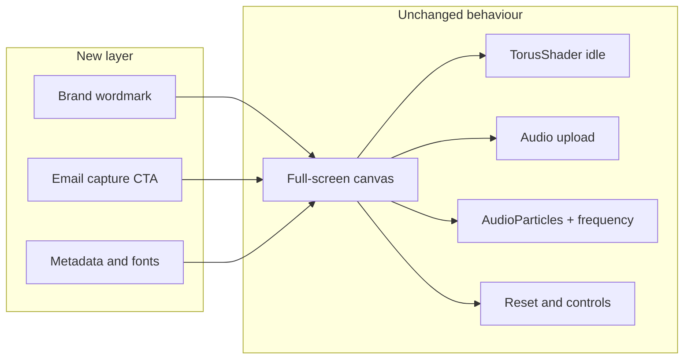

# Codebase Cleanup + Self Made Good Landing Page

## Current state

- **App surface:** [app/page.tsx](app/page.tsx) is the only route. It uses **Canvas** (React Three Fiber), **AudioParticles**, **TorusShader**, and **useAudioAnalyzer**. Idle state shows the torus; with audio it shows particles, frequency mode (mouse X/Y → lowpass/highpass), and controls (time, levels, reset).
- **Unused code:** No component in `app/` or the visualizer imports from `components/ui/`, `theme-provider`, or toast hooks. The entire [components/ui/](components/ui/) tree (~55 files), [components/theme-provider.tsx](components/theme-provider.tsx), and [hooks/use-toast.ts](hooks/use-toast.ts) are dead. [README.md](README.md) still describes "Imagen" and image-to-particles (stale).
- **Brand:** Self Made Good (@madeselfgood), tagline "Ora et Labora", launch March 2026. Luxury menswear, cinematic/minimal, deep blacks + one accent (forest green or burgundy), refined serif + clean grotesk, stoic tone. Goals: brand world first, email capture ("First Drop — March 2026"), minimal text, maximum visual storytelling.

---

## Part 1: Codebase cleanup (no behaviour change)

**Goal:** Remove unused code only. All current behaviour (torus, audio upload, particles, frequency filter, reset, time/levels UI) stays.

1. **Remove unused UI and providers**
   - Delete the entire [components/ui/](components/ui/) directory (no app or kept components reference it).
   - Delete [components/theme-provider.tsx](components/theme-provider.tsx) (not used in [app/layout.tsx](app/layout.tsx)).

2. **Remove unused hooks**
   - Delete [hooks/use-toast.ts](hooks/use-toast.ts) (toasts not used anywhere).
   - Delete [hooks/use-mobile.ts](hooks/use-mobile.ts) and any [components/ui/use-mobile.tsx](components/ui/use-mobile.tsx) if still present (not used in app). If only one exists, remove that one.

3. **Keep and optionally trim lib**
   - Keep [lib/utils.ts](lib/utils.ts) for `cn()` unless you prefer not to use it on the new landing chrome; it's small and useful for conditional classes (e.g. email form, brand bar).

4. **Dependencies**
   - After removing UI: drop **sonner** and **next-themes** from [package.json](package.json) (only used by removed components).
   - **lucide-react** is not used in the app; can be removed.
   - **class-variance-authority**, **clsx**, **tailwind-merge** are only used by removed UI and by `lib/utils`. If you keep `lib/utils`, keep **clsx** and **tailwind-merge**; **class-variance-authority** can be removed.

5. **Docs and metadata**
   - Update [README.md](README.md) to describe the current app: Self Made Good brand, audio visualizer (torus + particles, frequency filter), tech stack (Next.js, R3F, Tailwind). Remove references to "Imagen" and image upload.
   - Leave [app/layout.tsx](app/layout.tsx) metadata as-is for now; Part 2 will switch it to brand.

6. **Verification**
   - Run `pnpm build` and manual smoke test: load page → torus visible → upload audio → particles + frequency mode + reset all work. No new features in this part.

---

## Part 2: Subtle brand landing page

**Goal:** Turn the same experience into the brand's landing page with minimal, non-intrusive changes: identity, typography, one accent, wordmark, and email capture. No removal of features and no loud UI.

1. **Metadata and identity**
   - In [app/layout.tsx](app/layout.tsx): set `title` to "Self Made Good", `description` to the brand tagline/philosophy (e.g. "Ora et Labora. Luxury through labour."). Update `themeColor` to a deep black/charcoal. Point icons to brand assets when available (or keep current until you have a logo).

2. **Typography**
   - Brand: refined serif + clean grotesk. In [app/layout.tsx](app/layout.tsx), add a serif from `next/font` (e.g. **Cormorant Garamond** or **Libre Baskerville**) for headings/brand text; keep Geist (or similar) for body/UI. Expose the serif via a CSS variable (e.g. `--font-serif`) and use it in [app/globals.css](app/globals.css) / Tailwind theme.

3. **Colour and globals**
   - In [app/globals.css](app/globals.css): keep black/charcoal as base; add a single accent variable (e.g. `--accent: forest green or burgundy` in oklch or hex) for CTA and links. Use it for the email CTA and any single "Join" or "First Drop" button so the palette stays restrained.

4. **Brand chrome (subtle)**
   - Add a minimal wordmark on the canvas overlay (e.g. top-left or bottom-left): "Self Made Good" (serif) and "Ora et Labora" (small, muted). Use absolute positioning so the visualizer remains full-screen and behaviour unchanged. No extra pages or routes.

5. **Email capture**
   - Add a minimal block: CTA line "First Drop — March 2026" plus email input and submit (e.g. "Notify me" or "Join"). Prefer a single, subtle placement (e.g. bottom-right or bottom bar) so it doesn't compete with the visualizer. Use native `<form>`, `<input type="email">`, and `<button>` with Tailwind; optional `cn()` from `lib/utils` for state (e.g. loading). No toast dependency.
   - Backend: add an API route (e.g. `app/api/join/route.ts`) that accepts POST and returns 200/400. Implementation can be a stub that logs and returns success, with a TODO to plug in your provider (Resend, ConvertKit, Supabase, etc.). No degradation of existing audio/torus behaviour.

6. **Optional (later)**
   - Favicon/OG image: replace with Self Made Good assets when ready.
   - Very subtle shader tint (e.g. hint of accent colour in particles) can be a follow-up; not required for "subtle" landing.

---

## Flow after changes

Same single page: visualizer remains the main experience; brand and email sit on top as a thin layer.

---

## File change summary

| Action | Items |
|--------|--------|
| Delete | `components/ui/*` (all), `components/theme-provider.tsx`, `hooks/use-toast.ts`, `hooks/use-mobile.ts` (if unused) |
| Edit | `app/layout.tsx` (metadata, fonts), `app/globals.css` (accent, serif var), `app/page.tsx` (brand chrome + email form), `package.json` (remove sonner, next-themes, lucide-react, optionally cva), `README.md` (brand + current features) |
| Add | `app/api/join/route.ts` (email capture stub) |

---

## Order of work

1. Part 1: Remove unused UI, theme-provider, toast/mobile hooks; trim deps; update README; verify build and behaviour.
2. Part 2: Metadata and fonts → globals (accent, serif) → brand chrome and email form on page → API route stub.

This keeps "only the best code," preserves all current functionality, and subtly turns the site into the Self Made Good landing page with email capture and brand identity.
